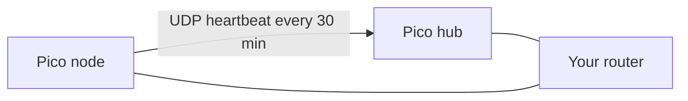

# Second Pico

Build this after the first board prints a status line.

The second Pico W uses the same 30-minute check. It joins the same Wi-Fi and sends one UDP packet to the first Pico. The packet carries the node name `pico-node`, that board's signal strength to your router, and that board's own message counts.

The first Pico listens for that packet and prints a second kind of line:

```text
ticks_ms,pico-hub,HEARD,pico-node,rssi,tx_msgs,rx_msgs,tx_bytes,rx_bytes
```

Put the first Pico's IP address in the second board's `secrets.py` as `HUB_IP`. Each board keeps its own `secrets.py`. The example file stays placeholders only.


